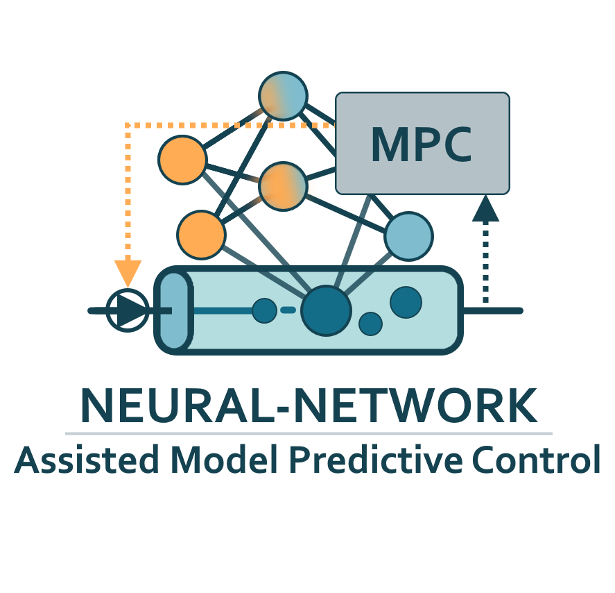

# Neural-Network Assisted MPC

The Neural-Network Assisted Model Predictive Control (NN-A-MPC) extends standard MPC by incorporating a neural-network (NN) to improve robustness when dealing with complex systems like flow reactors. In this strategy, a NN is used to quickly explore the input space and highlight promising operating regions. These regions are then further refined using an optimization based on a physics-based model (PBM), balancing accuracy with computational efficiency. Additionally, an integral compensation state is included to increase resilience against disturbances and model inaccuracies.

## Info

Here you can find the implementation of our NN-A-MPC which was tested on a heated flow reactor. You can find all the detail of the approach in [TODO](https://todo.at/).

- A0_TrainNN

    Within the folder you can find the Python code used for training the NN which is used in the design-space-exploitation (DSE).

- A1_NNAssistedMPC

    Within the folder you can find the implemented NN-A-MPC along the simulation of the real reactor. Find details on how to start/use the NN-A-MPC within the README.md in the folder. 